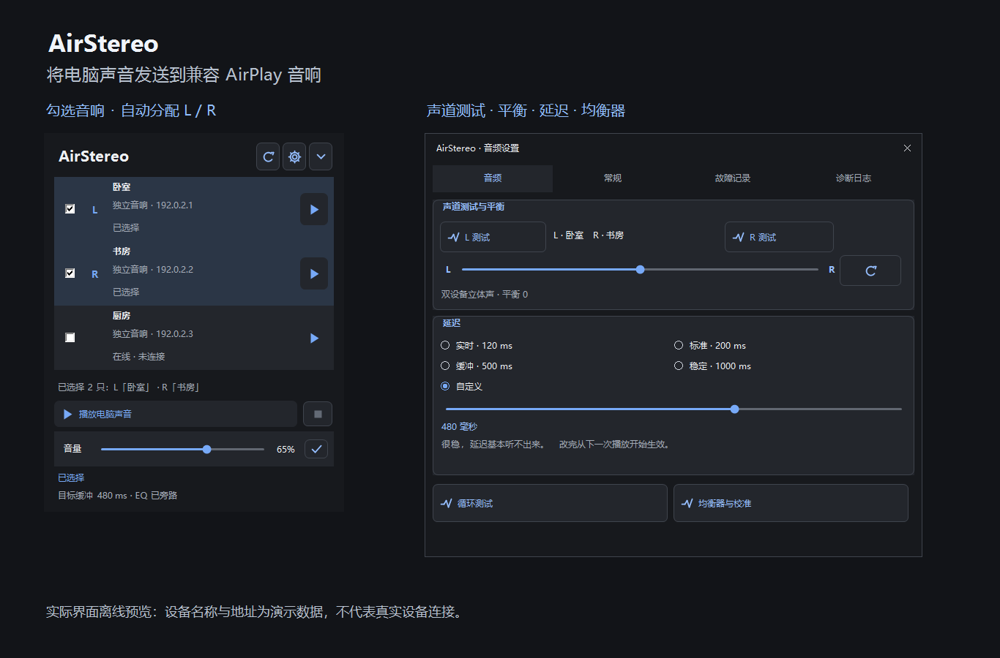

# AirStereo

[English](README.en.md)

Windows x64 AirPlay 音频发送应用。当前版本 **1.0.5**，源码与独立安装版的发布及更新来源为 [Flourishze/AirStereo](https://github.com/Flourishze/AirStereo)；商店版由 Microsoft Store 管理更新。

## 软件用途

**AirStereo 用于将 Windows 电脑正在播放的系统声音，通过局域网无线发送到兼容 AirPlay / AirPlay 2 的音响。** 你可以在电脑上播放音乐、视频或其他应用声音，再通过右下角托盘界面选择音响播放，无需把音频文件导入 AirStereo。

它是音频发送工具，不是音乐播放器，也不使用蓝牙连接。电脑和音响需要位于同一局域网，并允许设备发现与连接。软件采集默认音频输出设备的系统混音，不提供按应用单独选择或隔离采集。

### 适用场景

- **只有一只音响**：勾选一只独立音响，发送完整立体声，不必配置双设备。
- **有两只独立音响**：按勾选顺序分配 L / R，组成左右声道输出。
- **已在 Apple 家庭 App 中配成立体声对**：扫描信息明确识别配对后，以一个逻辑目标连接，由接收端分配物理左右声道。
- **有多只音响**：从列表中选择本次要使用的目标；当前最多选择两只独立音响，不支持任意数量的多房间同时播放。

### 主要功能

| 功能 | 说明 |
| --- | --- |
| 电脑声音无线播放 | 采集 Windows 系统播放音频并发送到兼容音响 |
| 音响列表勾选 | 自动扫描目标，按选择数量决定单设备或双设备播放 |
| 左右声道输出 | 两只独立音响共用音频时间线和 PTP 时钟，按顺序分配 L / R |
| 原生立体声对 | 明确识别的配对显示为单一目标，避免重复选择配对成员 |
| 音频设置 | 均衡器、音量、左右测试音、平衡与居中重置、延迟设置 |
| 托盘控制 | 从右下角打开简洁控制界面，另有可选开机自启 |
| 故障排查 | 查看连接故障、运行日志并打开本地 Diagnostics 文件夹 |
| 版本检查 | 手动检查本仓库正式版本，打开 Release 页面获取更新 |

[下载安装包](https://github.com/Flourishze/AirStereo/releases) · [问题反馈 / 功能建议](https://github.com/Flourishze/AirStereo/issues) · [更新记录](CHANGELOG.md)

## 界面预览

实际界面离线预览：设备名称与地址为演示数据，不代表真实设备连接。

## 安装与使用

EXE 提供安装向导，MSI 适合部署。商店版请使用上方 Microsoft Store 入口，由商店负责签名与更新；Release 中未签名的 MSIX 用于商店提交。请勿同时运行商店版与独立安装版。

从本仓库 Releases 下载 `AirStereo-Setup-1.0.5-x64.exe`，安装前从托盘菜单退出旧版。安装包附带 .NET Core 与 Windows Desktop 10.0.12 运行时，优先使用安装目录内的运行时。无需另装 .NET 运行时；仍需要受 .NET 10 支持的 Windows x64 系统。

1. 点击右下角 AirStereo 托盘图标，扫描并勾选音响。
2. 未选择时不能播放；选择一只独立音响时发送完整立体声，并禁用左右平衡。
3. 按顺序选择两只独立音响时，第一只为 L、第二只为 R，共用会话时间线和 PTP 时钟；最多选择两只。要交换左右，取消后按相反顺序勾选。
4. mDNS 明确识别的原生立体声对作为一个逻辑目标，完整立体声由接收端分配物理声道。成员不可重复选择；仅凭名称不确认原生配对。
5. 点击播放发送电脑声音。双设备会话任何一只掉线时停止整个会话，并提示故障，不静默降级。

实际兼容性取决于接收端固件、访问权限、网络与其公开的服务信息；不能保证所有宣称支持 AirPlay 的设备均可连接。

无线播放存在采集、网络传输和接收端缓冲延迟，延迟设置值不等于端到端实测延迟。AirStereo 不承诺零延迟，也不能替代需要极低延迟的游戏或实时监听设备。

## 1.0.5 更新重点

- 默认使用原生 ALAC 编码（44.1/48 kHz、双声道、16-bit、352 帧/包），并在诊断日志和托盘连接状态显示当前编码参数；`--pcm` 仅作为实验性回退开关。
- 静音期间继续保留媒体流和 RTP 时间线，默认使用 `repeat-last` 静音帧；连续确认源静音达到 90 分钟后才执行优雅断开。`--silence-mode=zero` 可用于实验比较。
- 修复无音频源时采集饥饿造成的发送落后与跳帧，饥饿期间仍发送填充块，避免静音期意外停发。
- 新增串流期间静音本机输出、启动时自动连接，以及诊断日志用户滚动后暂停跟随并在 10 秒无操作后恢复。
- 保留既有设备路由、PTP、重传、EQ、测试音和高 DPI 布局兼容性。

本版离线 SelfTest 已通过；HomePod 真机验收需由用户在目标设备上继续确认，不能以离线测试替代。右侧滚动条左键拖动问题未在本版声明修复。

## 设置

- **音频**：音量、延迟、左右平衡、平衡居中重置、左右测试音与均衡器。播放期间可调整音量、平衡并使用测试音；延迟在停止播放后调整，从下一次播放开始生效。测试音暂时绕过用户平衡值，结束后恢复。
- **常规**：开机自启、运行时与当前版本、手动检查更新。更新检查只使用本仓库最新正式 Release，不采用草稿或预发布；异步请求超时会提示失败，不误报“已是最新版”。新版本按钮打开正式发布页面，不自动下载安装或执行文件。
- **故障记录**：查看故障并打开实际存储文件夹。有无记录均可打开，目录不存在时自动创建；不再弹出保存文件对话框。优先写入安装目录 `Diagnostics`；不可写时回退到当前用户本地应用数据目录的 `AirStereo/Diagnostics`。
- **诊断日志**：查看当前运行信息。

故障日志可能含音响名称、网络地址与系统信息，请先检查再公开分享。默认不开启自动上传故障或自动安装更新。

## 问题反馈与功能建议

遇到连接失败、没有声音、声道或界面异常，或者希望增加功能，可以在本仓库的 [Issues](https://github.com/Flourishze/AirStereo/issues) 中提交反馈。

故障反馈请尽量提供：AirStereo 版本、Windows 版本、显示缩放比例（界面问题）、音响型号、单设备 / 双设备 / 原生配对类型、复现步骤，以及截图或脱敏后的故障日志。提交前可先搜索已有 Issue，避免重复反馈。请勿公开密码、令牌或未经检查的个人与网络信息。

## 构建与文档

详见 [构建说明](docs/BUILD.md)、[验收清单](docs/TESTING.md)、[更新记录](CHANGELOG.md) 和 [1.0.5 发布说明](docs/releases/v1.0.5.md)。应用源码与打包脚本提供；既有安装向导的原始源码未保留，因此打包仍依赖明确标注的二进制模板。

## 许可说明

AirStereo 自有代码与文档采用 [MIT 许可证](LICENSE)，Copyright (c) 2026 Flourishze。使用、修改或分发时须保留版权声明与许可文本；软件按现状提供，不附带保证。

第三方代码、依赖、.NET 运行时与安装器二进制模板不因本仓库采用 MIT 而变更许可，仍须遵守各自的许可条款。随安装包分发的 .NET 运行时保留其原有 LICENSE 与 ThirdPartyNotices。

AirStereo 是独立项目，非 Apple 官方应用。AirPlay、HomePod 等商标属于各自权利人。

